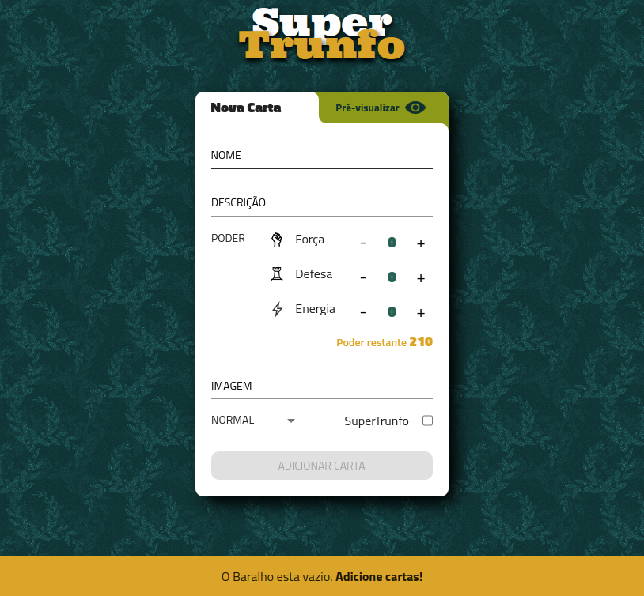

<table width="100%">
    <!-- <tr>
        <td colspan="3">
          
        </td>
    </tr> -->
    <tr>
        <td width="33%"></td>
        <td width="33%"></td>
        <td width="33%"></td>
    </tr>
</table>


# SuperTrunfo Card Manager

Esta aplicação foi desenvolvida com o objetivo de criar e gerenciar cartas para um jogo no estilo SuperTrunfo, demonstrando a implementação das seguintes habilidades:
- Leitura do estado de um componente e uso desse estado para alterar o que é exibido no navegador.
- Inicialização de um componente com um estado pré-definido.
- Atualização do estado de um componente em tempo real.
- Captura de eventos utilizando a sintaxe do React.
- Criação de formulários utilizando a sintaxe JSX.

## Importância deste projeto
Quando lidamos com informações, existem quatro operações fundamentais que são cruciais para o sucesso de uma aplicação: **Criar** (create), **Ler** (read), **Atualizar** (update) e **Excluir** (delete). O projeto SuperTrufo representa o meu primeiro passo na realização de algumas dessas operações, com foco principal na criação, leitura e exclusão de informações.

Em alguns casos, a aplicação faz uso de [Renderização Condicional](https://pt-br.reactjs.org/docs/conditional-rendering.html) para controlar a exibição de elementos na interface do usuário. .

**Observação**: Este projeto foi originalmente criado como um componente de classe e posteriormente transformado em um componente funcional para seguir as melhores práticas do React.

## Dependências
Para a construção deste projeto, foram utilizadas as seguintes dependências:

- **Material-UI**: Uma biblioteca de componentes de interface de usuário para React que simplifica o desenvolvimento de interfaces elegantes e responsivas.
- **uuid**: Uma biblioteca para geração de IDs únicos. Essa dependência é utilizada para atribuir identificadores exclusivos a cada carta no jogo.

Certifique-se de instalar essas dependências antes de executar a aplicação. Para mais informações sobre o pacote uuid, consulte [aqui](https://www.npmjs.com/package/uuid).

## Hospedagem
A aplicação está atualmente hospedada em https://tryunfo.severidade.com.br/. 
Você pode acessá-la online e experimentar o SuperTrunfo Card Manager em ação!

## Como Iniciar a Aplicação
1. Clone este repositório para sua máquina local.
2. Certifique-se de ter o Node.js instalado. Se não estiver instalado, você pode baixá-lo em [Node.js](https://nodejs.org/).
3. No diretório raiz do projeto, execute o seguinte comando para instalar as dependências:

```bash
npm install
```

4. Após a conclusão da instalação, você pode iniciar a aplicação com o seguinte comando:

```bash
npm start
```